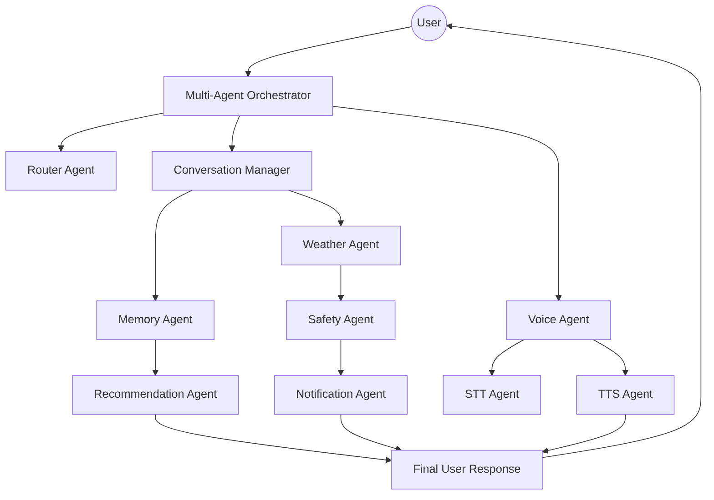

# Voice AI Multi-Agent Platform

## Project Vision
This repository is designed to evolve into a production-quality **Voice AI Multi-Agent Platform**. The goal is to create a modular, scalable system where specialized agents collaborate to provide a seamless voice-driven user experience, leveraging **LangGraph** for complex orchestration and state management.

The platform will transition from a single-purpose weather agent into a comprehensive ecosystem capable of handling voice interactions, maintaining long-term memory, and coordinating multiple domain-specific agents.

## Current Status
- **Phase 1 (Completed):** Weather AI Agent implementation.
- **Phase 2 (Planned):** Multi-Agent Orchestration and Voice Integration.

**Note:** Currently, only the `Weather-AI-Agent` is fully implemented. All other directories under `multi_agent/` are placeholders for future development.

## Repository Structure
```text
project-root/
├── multi_agent/               # Multi-Agent Architecture
│   ├── orchestrator/           # Global coordination and state management
│   ├── agents/                # Specialized Agent implementations and placeholders
│   │   ├── weather_agent/       # Phase 1: Stable Weather AI implementation (Implemented)
│   │   │   ├── core/            # LLM and configuration
│   │   │   ├── data/            # Data management
│   │   │   ├── graph/            # LangGraph workflow and routing
│   │   │   ├── nodes/            # Specialized weather nodes
│   │   │   ├── persistence/      # Database and session storage
│   │   │   ├── prompts/         # Agent prompts
│   │   │   ├── schemas/          # Data models
│   │   │   ├── services/         # API integrations (Open-Meteo, etc.)
│   │   │   ├── ui/              # Streamlit interface
│   │   │   └── tests/            # Test suite
│   │   ├── weather_agent_v1/    # Basic Weather AI implementation (Implemented)
│   │   │   ├── agent/           # Graph and nodes
│   │   │   └── tools/           # Weather API tools
│   │   ├── router_agent/        # Intent classification and routing (Placeholder)
│   │   ├── conversation_agent/  # Dialogue state and flow management (Placeholder)
│   │   ├── memory_agent/        # Long-term and short-term memory (Placeholder)
│   │   ├── voice_agent/           # Voice session coordination, STT, and TTS (Placeholder)
│   │   ├── recommendation_agent/ # Context-aware suggestions (Placeholder)
│   │   ├── safety_agent/        # Severe weather alerts and safety (Placeholder)
│   │   └── notification_agent/   # Multi-channel alert delivery (Placeholder)
│   ├── shared/                # Common utilities and base classes
│   ├── prompts/               # Centralized prompt management
│   ├── schemas/                # Inter-agent communication models
│   ├── services/               # External service wrappers
│   └── docs/                  # Technical architecture documentation
│
├── main.py                    # Entry point for basic weather agent
├── requirements.txt           # Dependencies
└── README.md                   # Project documentation
```

## Architecture Diagram


## Phase 1: Weather AI Agent (Completed)
The current implementation is a stable, single-purpose agent that fetches real-time weather and replies in natural language. It serves as the foundational "Weather Agent" for the future platform.

### Key Features:
- Real-time weather fetching via Open-Meteo.
- Natural language response generation.
- LangGraph-based workflow.
- Streamlit UI for interactive use.

## Future Multi-Agent Architecture
The platform will evolve into a modular system where:
1. **Orchestrator** manages the global state and coordinates agent hand-offs.
2. **Router** determines the intent and directs the query to the correct agent.
3. **Voice Agents** handle the audio pipeline (STT $\rightarrow$ Processing $\rightarrow$ TTS).
4. **Specialized Agents** (Weather, Memory, Safety) provide domain-specific expertise.

## Planned Voice AI Agents
- **Router Agent:** Intent classification.
- **Conversation Manager:** Dialogue state tracking.
- **Voice Agent:** Audio session management.
- **STT/TTS Agents:** Speech-to-Text and Text-to-Speech integration.
- **Memory Agent:** User preferences and historical context.
- **Safety/Alert Agent:** Critical weather monitoring.

## Technology Stack
| Category | Technology |
| --- | --- |
| Agent Framework | LangGraph |
| LLM | GPT-4 / Claude (via LangChain) |
| Voice Processing | Whisper (STT), ElevenLabs/Azure (TTS) |
| UI | Streamlit |
| Language | Python 3.10+ |
| Persistence | SQLite / PostgreSQL |

## Development Roadmap
- [x] **Phase 1:** Basic Weather AI Agent (Stable)
- [ ] **Phase 2:** Multi-Agent Orchestration Skeleton
- [ ] **Phase 3:** Voice Integration (STT/TTS)
- [ ] **Phase 4:** Persistent Memory and User Profiling
- [ ] **Phase 5:** Advanced Safety and Notification Systems
- [ ] **Phase 6:** Production Hardening and Evaluation
